# It's DebateTime! A Debate App - TheHackLab Bocconi

Welcome to our Debate App Project, created for TheHackLab Bocconi. This application is designed to facilitate debates for amateurs and foster a community of debating enthusiasts.


## Overview

**DebateTime **is a project aimed at hosting engaging and organized debates under the parlimentary procedure (more formats to come in the future). It hosts a platform for debate matchmaking with friends or strangers and aims to encourage community-building and collaboration. The app was submitted to the first ever Bocconi TheHackLab competition and presented to the 'Bocconi 4 Innovation' startup accelerator.

## Features

- **Create Debates**: Initiate new debate topics with friends or strangers.
- **AI powered Feedback**: Using the ChatGPT API, the app offers a summary of all the arguments throughout the debate and provides feedback on the performance of each participant.
- **Participant Interaction**: Multiple participants can join and contribute to ongoing debates as a jury. Passive viewers score the performances which in turn enriches the quality of the feedback provided.
- **Argument Management**: Submit, edit, and refine arguments in advance using the personal notes editor-
- **Simple and Intuitive UI**: User-friendly design focused on seamless interaction.

## Requirements
To run DebateTime, you’ll need:
- macOS with the latest version of Xcode installed.
- An iOS device or simulator.
- A free or paid Apple Developer account for testing on physical devices.

## Installation

### 1. Clone the Repository
```bash
git clone https://github.com/GianiRanzetti/Debate-App---TheHackLab.git
cd Debate-App---TheHackLab
```

### 2. Open the Project in Xcode
1. Launch Xcode.
2. Open the `.xcodeproj` or `.xcworkspace` file located in the project directory.

### 3. Configure the Project
- Select your target device (iPhone or Simulator).
- Go to **Signing & Capabilities** in Xcode and add your Apple Developer account if required.

### 4. Build and Run
- Click the **Run** button (or press `Cmd + R`) to build and launch the app on your chosen device or simulator.

### 5. Test on a Physical Device (Optional)
1. Connect your iOS device via USB.
2. Select your device from the target options.
3. Ensure your Apple Developer account is properly configured to sign the app.

## Usage

### User Profile

1. **Access Profile**: Click the **Profile** button on the home page.
   
   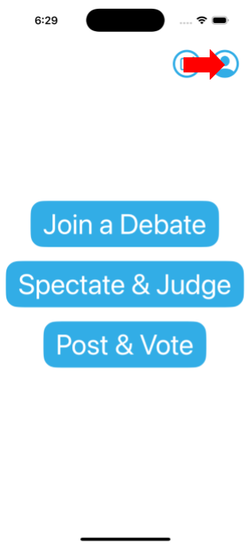

2. **View Profile Information**: Navigate to the Profile page to view your details.
   
   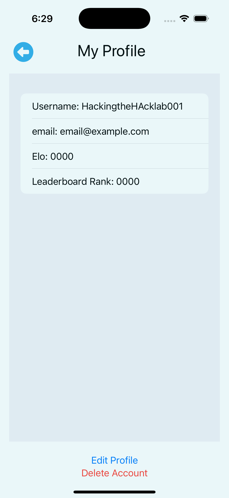

---

### Joining a Debate

1. **Join a Game**: Click the **Join a Game** button on the home screen. Topics are randomized to ensure fairness.
   
   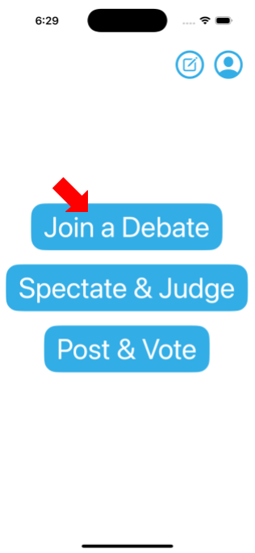

2. **Preparation Phase**: A 10-minute preparation timer begins. During this time, chat is private between team members.
   
   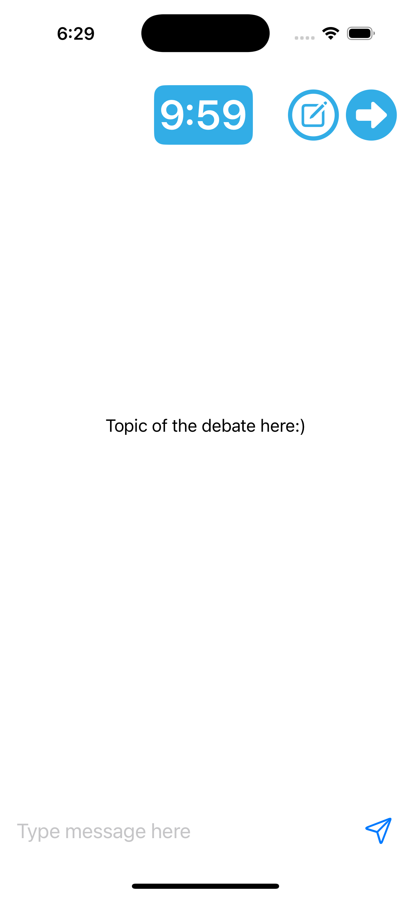

3. **Debate Phase**: Each speaker has 5 minutes to present their arguments. The active speaker is highlighted in blue, while others are muted.
   
   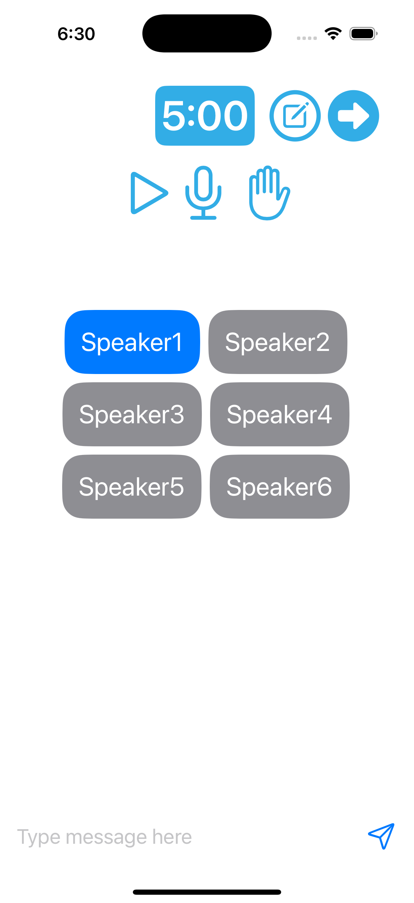

---

### Using the Personal Notes Feature

1. **Access Notes**: Click the **Notes** button on the home page.
   
   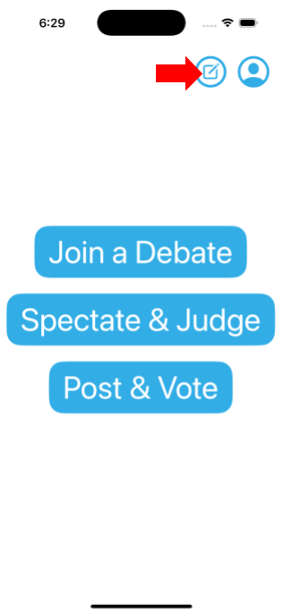

2. **Manage Notes**: Use the personal notes section to create and save private notes locally.
   
   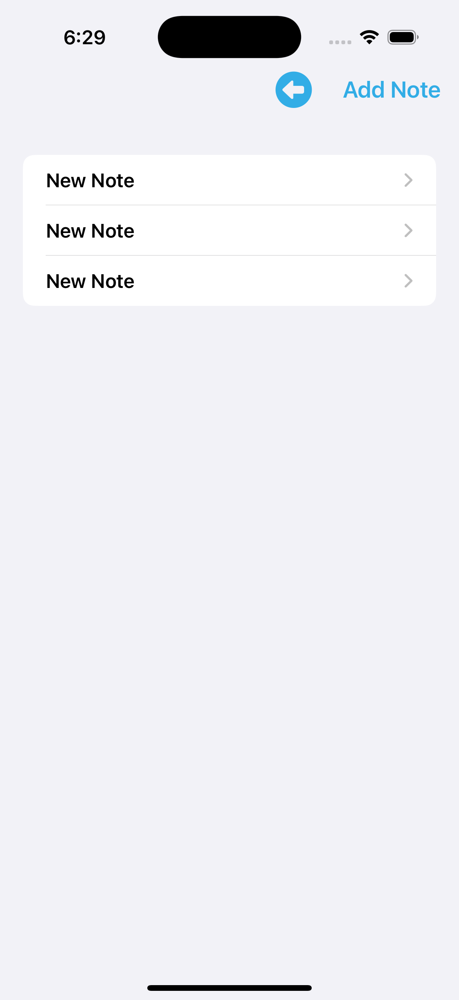

3. **Retrieve Notes During Debate**: Access your pre-prepared notes anytime during a debate by clicking the **Notes** button.
   
   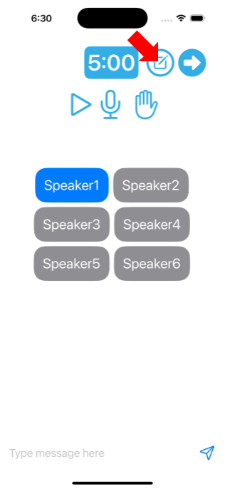

---

### Joining as a Jury Member

1. **Spectate and Judge**: Click the **Spectate & Judge** button on the home screen.
   
   

2. **Select a Topic**: Choose a debate topic to spectate and evaluate.
   
   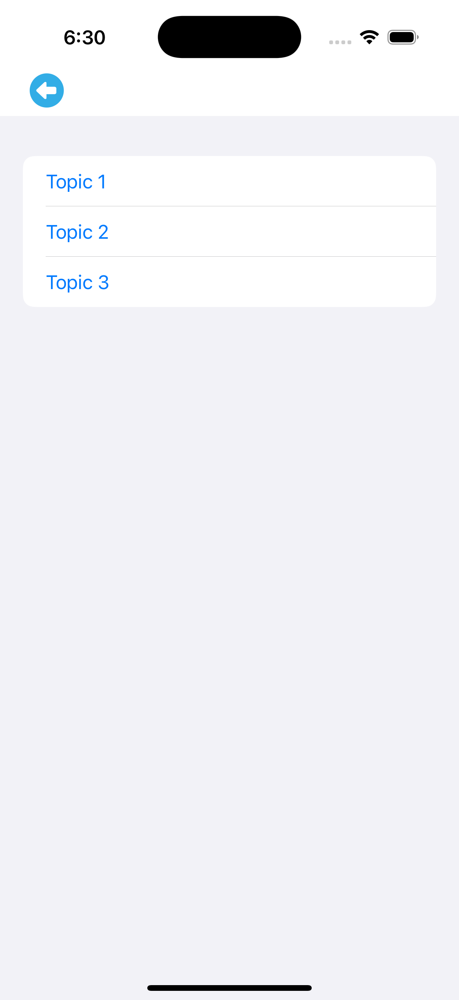

3. **Engage in Jury Chat**: Discuss in real-time with other jury members using the private chat.
   
   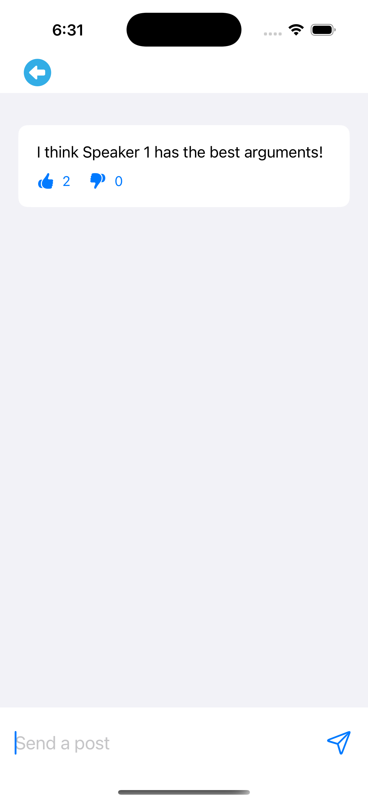

4. **Vote and Rate**: Cast your vote for the winning team and best speaker, and rate each participant's performance.
   
   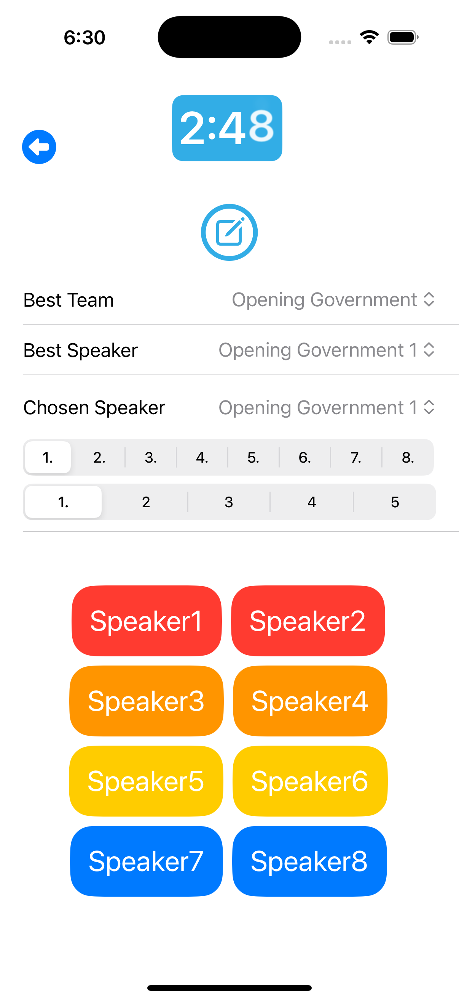

---

### Receiving AI Feedback

1. **Get Feedback**: After the debate, click the **Get Feedback from AI** button in the feedback pop-up.
   
   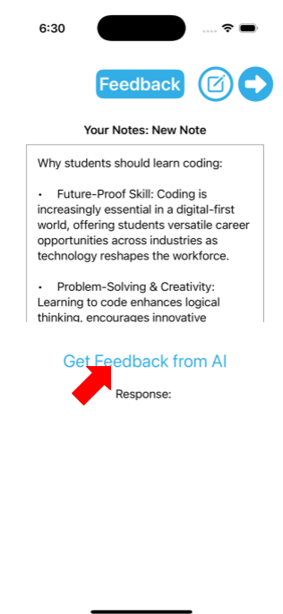

2. **View AI Summary**: The ChatGPT API provides a summary of arguments and evaluates performance. Jury scores are also displayed.
   
   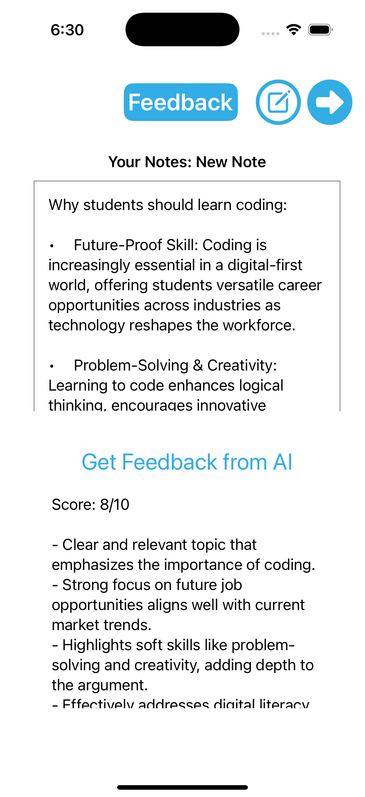


## License

This project is licensed under the MIT License. See the [LICENSE](LICENSE) file for details.

## Contact

For questions, feedback, or collaboration:
- **Authors**:
- Chase Damla Ünal -
- Türkü Aleyna Arar - 
- Justin Tang - tangjust@outlook.com
- Renzo Gonzales -
- Giani Ranzetti - gianiranzetti1@gmail.com


