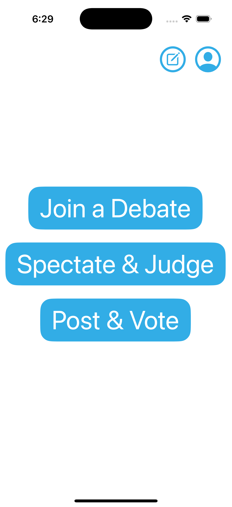
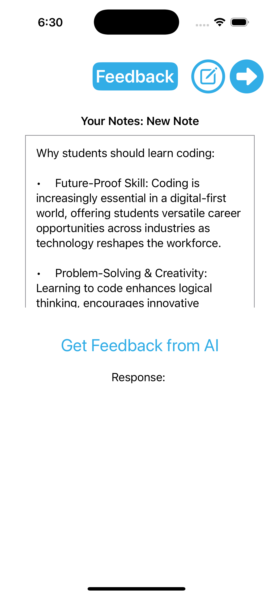

# Debate App - TheHackLab Bocconi

Welcome to our Debate App Project, created for TheHackLab Bocconi. This application is designed to facilitate debates for amateurs and foster a community of debating enthusiasts.

## Overview

The Debate App is a project aimed at hosting engaging and organized debates under the parlimentary procedure (more formats to come in the future). It hosts a platform for matchmaking with friends or strangers and aims to encourage community-building and collaboration. The app was submitted to the first ever Bocconi TheHackLab competition and presented to the 'Bocconi 4 Innovation' startup accelerator.

## Features

- **Create Debates**: Initiate new debate topics with friends or strangers.
- **AI powered Feedback**: Using the ChatGPT API, the app offers a summary of all the arguments throughout the debate and provides feedback on the performance of each participant.
- **Participant Interaction**: Multiple participants can join and contribute to ongoing debates as a jury. Passive viewers score the performances which in turn enriches the quality of the feedback provided.
- **Argument Management**: Submit, edit, and refine arguments in advance using the personal notes editor-
- **Simple and Intuitive UI**: User-friendly design focused on seamless interaction.

## Requirements
To run the Debate App, you’ll need:
- macOS with the latest version of Xcode installed.
- An iOS device or simulator.
- A free or paid Apple Developer account for testing on physical devices.

## Installation

### 1. Clone the Repository
```bash
git clone https://github.com/GianiRanzetti/Debate-App---TheHackLab.git
cd Debate-App---TheHackLab
```

### 2. Open the Project in Xcode
1. Launch Xcode.
2. Open the `.xcodeproj` or `.xcworkspace` file located in the project directory.

### 3. Configure the Project
- Select your target device (iPhone or Simulator).
- Go to **Signing & Capabilities** in Xcode and add your Apple Developer account if required.

### 4. Build and Run
- Click the **Run** button (or press `Cmd + R`) to build and launch the app on your chosen device or simulator.

### 5. Test on a Physical Device (Optional)
1. Connect your iOS device via USB.
2. Select your device from the target options.
3. Ensure your Apple Developer account is properly configured to sign the app.

## Usage

### User profile
1. Click the "Join a Game" button.


2. Access your Profile Info


### Joining a Game:
1. Click the "Join a Game" Button on the home screen. The topics cannot be chosen by participants to avoid giving unfair advantages to the creator of the lobby.


2. Instantly, the 10 minutes of preparation time begins. The chat is private between team members in this window.


2. When the prep time finishes, each speaker will have 5 minutes to lay out their arguments. The speaker who has the floor is highlighted in blue, all other speakers are muted.


### Using the Personal notes feature:
1. Click on the 'Notes' button in the home page


2. Each user has access to their own private and personal notes. Files are locally saved so they don't get deleted when the app is closed.


3. At any point during a debate, these pre-prepared files can be accessed by re-clicking the 'Notes' button


### Joining a game as a member of the jury:
1. Click the 'Spectate & Judge' button on the Home screen


2. Select which topic you want to spectate


3. Discuss with other member's of the jury in a private chat in real time


4. Vote on you winning team and on the best speaker. Rate each speaker individually on their performance.


### Receiving AI feedback:
1. When the debate ends, The feedback pop-up appears. Click on 'Get Feedback from AI' button.


2. The ChatGPT API will be queried, it will summarize your arguments throughout the debates and evaluate them. The average score given by members jury is also displayed in this section.


## License

This project is licensed under the MIT License. See the [LICENSE](LICENSE) file for details.

## Contact

For questions, feedback, or collaboration:
- **Authors**:
- Chase Damla Ünal -
- Türkü Aleyna Arar - 
- Justin Tang - tangjust@outlook.com
- Renzo Gonzales -
- Giani Ranzetti - gianiranzetti1@gmail.com


